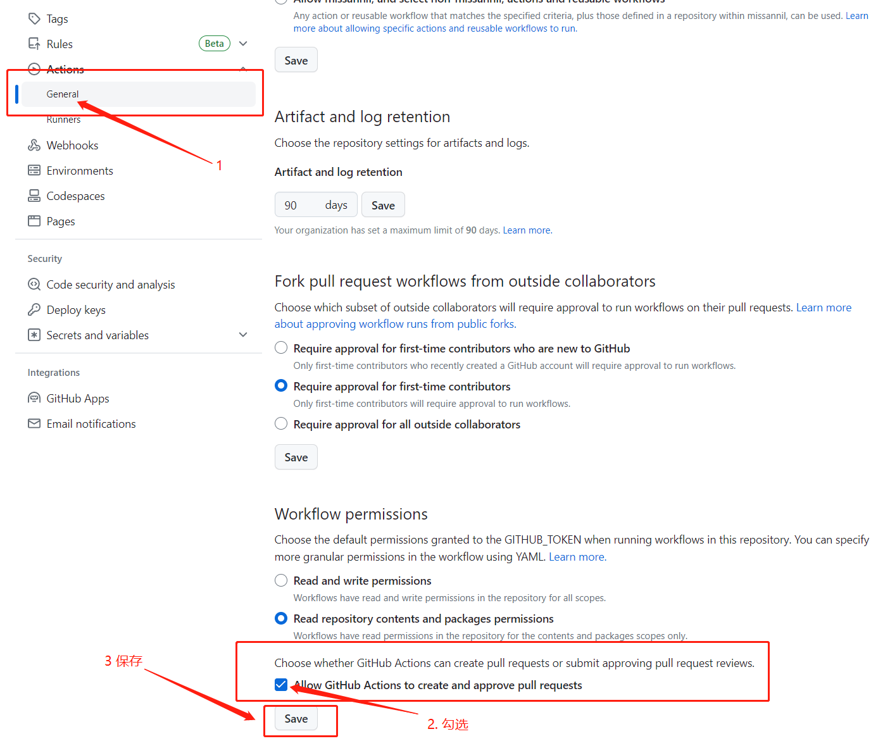

## Release Please

Release Please 是 Google APIs(https://github.com/googleapis)下的一个开源项目(https://github.com/googleapis/release-please),属于github actions 应用。

Release Please 会创建一个发布分支(release-please-xxx),在 main 分支有的提交时, 解析 git 历史记录,根据提交消息(要求符合[常规提交]规范),生成一个发布版本的 commit,并创建对 main 分支的 PR,PR 自动增改 CHANGELOG 内容,自动增改版本(例如 npm 项目的 package.json 中的版本信息),并有版本标签(tag)。

## 实操 demo

1. **建立 test-release-please 项目(建立 README)**

    

2. **设置 actions 创建 PR 权限**

    

    不开启权限 release-please 运行时会报错
    

3. **初始化 npm 添加 release-please.yml**

-   克隆项目到本地 `npm init -y`

-   根目录下建立`.github/workflows/release-please.yml`文件内容如下

    ```yml
    # 触发actions时机
    on:
        push:
            branches:
                - main
    # 权限
    permissions:
        contents: write
        pull-requests: write
    # 工作流名称
    name: release-please
    # 工作流程
    jobs:
        # 第一个工作
        release-please:
            # 运行环境
            runs-on: ubuntu-latest
            steps:
                # 使用哪个action
                - uses: google-github-actions/release-please-action@v3
                  # action id 便于其他流访问
                  id: release
                  with:
                      #项目类型
                      release-type: node
                      #包名称
                      package-name: test-release-please
    ```

4. **提交代码**

    ```bash
    $ git add .
    $ git commit  -m 'chore: npm init and create release-please.yml
    >
    > Release-As: 0.0.0'
    $ git push
    ```

    > 提示: 提交信息中 `Release-As: 0.0.0`字段会被 release-please 抓取,release-please 会基于这个版本(默认读取项目中的上次版本,此例中上次版本默认为 1.0.0,即 npm 初始化时的版本)升级版本。

5. **建立分支**
   release-please action 在无自己的分支时,会建立一个自己的分支(空),读取 main 分支的提交记录,并生成 changelog,并修改版本号为`0.0.0`

    **新建的分支**(release-please--branches--main--components--test-release-please)

    

    **分支下的 CHANGELOG**

    

    **分支下的 package.json**

    

6. **查看合并 PR**

    当 release-please 分支改动后会自动建立 PR

    

    合并 PR(建议使用 merge-squash)

    

7. **小结**
   当推送(push)代码到 main 分支时,github 会读取.github\workflows\release-please.yml,运行 yml 配置中的 jobs(release-please),release-please 根据 commit 信息 创建`release-please--branches--main--components--test-release-please`(以下简称 PR 分支),由于提交信息中包含 `Release-As`字段,所以 PR 版本变为了指定的版本(0,0,0),合并 PR 到 main 分支后,查看 release-please 分支
   
   可以看到 2 个 commit,一个在 main 之前一个在之后,因为 release-please 建立空分支(首次运行)后,读取到 2 次 commit,一次为建立仓库时,一次为 push(chore: npm init and create release-please.yml).

8. **集合提交功能**
   release-please 后续会维护它生成的分支的,并根据最新的提交信息(可多次),生成 PR。
   即每次对 main 分支 push 时(release-please action 触发),就会对 PR 重新整理。

    假如你对 main 分支进行一次提交,信息为: `fix: x bug`,release-please 在生成的 PR 中,会在 changelog 中加入提交信息,并修改发布版本为 0.0.1.在没有进行合并入 main 分支的情况下,你又提交了一次,信息为:`feat: feature A`
    release-please 会重新整理 PR 内容,在 changelog 中加入`feat: feature A`,修改发布版本为`0.1.0`(MINOR 升级重置 patch)。
    总之,在你不合并发布 PR 进入 main 的情况下,release-please 一直会维护这个发布 PR,直到你并入了 main 后(删除),在下一次 push 时生成新的 PR。

9. **默认支持的[提交信息前缀]**
    type must be one of [build, chore, ci, docs, feat, fix, perf, refactor, revert, style, test] [type-enum]
    ```ts
    const DEFAULT_HEADINGS: Record<string, string> = {
        feat: 'Features', // 功能
        fix: 'Bug Fixes', // bug 修复
        perf: 'Performance Improvements', // 性能改进
        deps: 'Dependencies', // 依赖修改
        revert: 'Reverts', // 退回
        docs: 'Documentation', // 文档相关
        style: 'Styles', // 样式
        chore: 'Miscellaneous Chores', // 杂项
        refactor: 'Code Refactoring', // 重构
        test: 'Tests', // 测试相关
        build: 'Build System', // 构建
        ci: 'Continuous Integration' // 持续集成
    };
    ```

10. **自定义配置** https://github.com/googleapis/release-please/blob/main/docs/customizing.md#changelog-types

11. **自动发布 npm**

    修改 yml 文件内容如下:

    ```yml
    # 触发actions时机
    on:
        push:
            branches:
                - main
    # 权限
    permissions:
        contents: write
        pull-requests: write
    # 工作流名称
    name: release-please
    # 工作流程
    jobs:
        # 第一个工作
        release-please:
            # 运行环境
            runs-on: ubuntu-latest
            steps:
                # 使用哪个action
                - uses: google-github-actions/release-please-action@v3
                  # action id 便于其他流访问
                  id: release
                  with:
                      #项目类型
                      release-type: node
                      #包名称
                      package-name: test-release-please
                # The logic below handles the npm publication:
                - uses: actions/checkout@v3
                  # if语句为真运行actions。
                  # 当id为release的action结果为created时(即并入了main分支时)
                  if: ${{ steps.release.outputs.release_created }}
                  # 开启node坏境
                - uses: actions/setup-node@v3
                  with:
                      node-version: 18
                      registry-url: 'https://registry.npmjs.org'
                  if: ${{ steps.release.outputs.release_created }}
                  # 发布包命令
                - run: npm publish
                  env:
                      # 在项目-settings-secrets and variables-actions 下建立Repository secrets,名字为NPM_TOKEN,值为npm下建立的密钥。
                      NODE_AUTH_TOKEN: ${{ secrets.NPM_TOKEN }}
                  if: ${{ steps.release.outputs.release_created }}
    ```
### yml 文件中的`${{ }}`语法

${{ }} 是 YAML 中的内嵌表达式语法。它用于表示一些动态的值或表达式，并能够在运行时被解析和计算出其具体的值。其常用于配置管理、自动化流程等场景中，例如 GitHub Actions 的工作流程（Workflow）中。

在 ${{ }} 中可以使用一些内置的函数、变量、表达式等，例如：

${{ env.VARIABLE_NAME }}: 用于获取环境变量的值

${{ github.EVENT_NAME }}: 用于获取触发 GitHub Action 的事件名称

${{ steps.STEP_ID.outputs.OUTPUT_NAME }}: 用于获取上一个步骤的输出值

${{ format('Hello, {0}!', 'World') }}：用于格式化字符串

${{ toJSON(object) }}：用于将对象序列化为 JSON 字符串

这些表达式可以用于动态地生成配置、计算某些属性或参数的值等。使用 ${{ }} 语法时，需要注意正确的嵌套顺序，以及表达式中的引号和转义字符等。

总之，${{ }} 是 YAML 中的内嵌表达式语法，可用于动态计算配置中的值，通常用于各种自动化任务和工作流程设计中。

### 一些错误

-   release-please-action@v3
    提示:
    ✖ Error when creating branch
    ✖ RequestError [HttpError]: Error creating Pull Request: Resource not accessible by integration
    
    解决:由于格式化给 yml 配置文件缩进弄错导致.更改 yml 配置字段缩进。
-   X npm publish  
    提示: **is not a legal HTTP header value**
    解决:更换 Environment secrets

    

[SemVer]: https://semver.org/
[常规提交]: https://www.conventionalcommits.org/
[我们建议改用 squash-merge]: https://github.com/googleapis/release-please#linear-git-commit-history-use-squash-merge
[引导清单配置]: https://github.com/googleapis/release-please/blob/main/docs/cli.md#bootstrapping
[语义版本]: https://semver.org/
[github.com/googleapis/repo-automation-bots]: https://github.com/googleapis/repo-automation-bots
[customizing]: https://github.com/googleapis/release-please/blob/main/docs/customizing.md
[release-please]: https://github.com/googleapis/release-please
[dist-tags]: https://docs.npmjs.com/cli/v9/commands/npm-dist-tag/
[google-github-actions/release-please-action]: https://github.com/google-github-actions/release-please-action
[release-please CLI]: https://github.com/googleapis/release-please/blob/main/docs/cli.md
[传统提交消息]: https://www.conventionalcommits.org/
[提交信息前缀]: https://github.com/googleapis/release-please/blob/main/src/changelog-notes.ts
