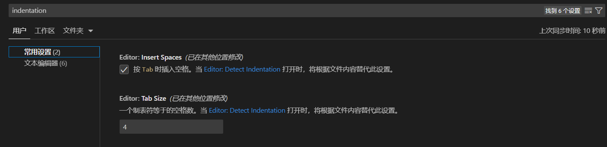

### 制表符由来

制表符（Tab）最初是打字机的一个功能，常用于在文本中插入垂直对齐的空格。打字机还没有像现代计算机一样有能够在页面上打印出连续空格的功能。在打字机上打印连续的空格需要按空格键多次，这很浪费时间，因此制表符被引入了。

在计算机时代，制表符的概念得到了保留，但其意义有所扩展。与打字机不同，现代计算机具有在文本中插入许多连续空格的功能，制表符在现代计算机上用于定义缩进和对齐。

总之，制表符最初是打字机的一个功能，用于在文本中插入垂直对齐的空格，以便更容易地理解文本结构。在计算机时代，制表符的意义也得到了保留，通常用于定义缩进和对齐。

### 制表符在不同系统之间的区别

在不同的操作系统和应用程序中，制表符的行为和宽度可能会有所不同，这可能会导致在不同平台和编辑器之间共享文件时出现问题。例如，Windows 和 Linux / Unix 系统中的默认制表符宽度不同，因为 Windows 中的制表符默认为 4 个空格，而 Linux 和 Unix 中的制表符默认为 8 个空格。

此外，某些编辑器允许在配置中指定制表符的宽度和行为。例如，有些编辑器允许将制表符(tab)大小设置为所需大小的空格数。这些差异可以影响不同编辑器和操作系统的易读性和可移植性，因此在跨平台环境中，建议使用空格而不是制表符来进行缩进。

### vs code 配置

vs code 中默认用 4 个空格表示一个制表符(tab)。



> 提示: 省缺(default)配置不会出现在 settings.json 中。

vs code 还默认开启了缩进检测


即在有缩进的文件中,文件中的缩进格式会代替 vscode 配置。比如文件中缩进为 2 个空格,那么在此文件中缩进不会为 vs code 默认的 4 空格(tab)长度。

### 缩进引发的问题

由于在不同系统之间,tab 键的识别长度不一(上面有讲到),这导致公共代码(例如 github 上的库)在被引入到不同系统时,展示的代码风格会不统一。

即使你使用 vs code 自动检测到源码文件的缩进,在修改此文件时可以做到缩进一致.但如果是添加文件呢,或者使用其他 IDE(integrated development environment)呢。

### [EditorConfig](https://editorconfig.org/) for Visual Studio Code

.editorconfig 是一个配置文件，用于定义项目中不同文件的格式规则和编码样式。它可用于协调不同开发人员、团队或组织之间的代码格式统一，确保代码的可读性和可维护性。

.editorconfig 格式规则通常包括缩进、缩进风格、换行符、文件编码等，并且可以针对不同类型的文件或文件夹进行定义。例如，您可以为 JavaScript 文件指定缩进规则为 2 个空格、使用 LF（Linux）换行符和 UTF-8 编码，而为 CSS 文件指定缩进规则为 4 个空格、使用 CRLF（Windows）换行符和 UTF-8 编码。

使用 .editorconfig 可以有效地减少由于代码格式不一致导致的问题，例如代码合并时的冲突、代码阅读时的困惑等。此外，.editorconfig 文件易于维护和共享，可以帮助开发团队保持一致的代码风格和编码样式。

.editorconfig 文件的格式和语法相对简单，可以使用文本编辑器或 IDE 来创建、编写和编辑它。除了在不同的编辑器中直接支持外，还可以使用许多支持 .editorconfig 文件的插件和工具来增强其功能。

总之，.editorconfig 是一种用于协调不同开发人员、团队或组织之间的代码格式一致性的配置文件，它定义了项目中不同文件的格式规则和编码样式，有助于保持代码的可读性和可维护性。

### 换行符

键盘的回车键在不同操作系统下输出的字符是不同的。

在 Windows 系统中，回车键输出“\r\n”（即 Carriage Return + Line Feed，回车符加换行符）；在 Mac OS 系统中，回车键输出“\r”（即 Carriage Return，只有回车符）；在 Linux 和 Unix 系统中，回车键输出“\n”（即 Line Feed，只有换行符）。

由于这些字符的不同，当您在不同操作系统之间共享代码时，特别是在使用版本控制系统（如 Git）进行协作时，可能会遇到换行符的问题，导致代码风格出现差异。为了避免这种问题，我们可以在编辑器中使用“换行符转换器”（Line Ending Converter）来将文件的换行符转换为特定操作系统的换行符格式，以确保代码文件的一致性。

许多文本编辑器和 IDE 都提供了换行符转换器（Line Ending Converter）这样的功能，并且可以设置自动转换或手动转换，以便将文件转换为特定的操作系统格式。另外，在提交代码之前，请始终检查您的更改是否符合项目的编辑器配置和 .gitattributes 指定的换行符格式，以确保项目中的代码风格始终一致。

```.gitattributes
* text=auto eol=lf
```
